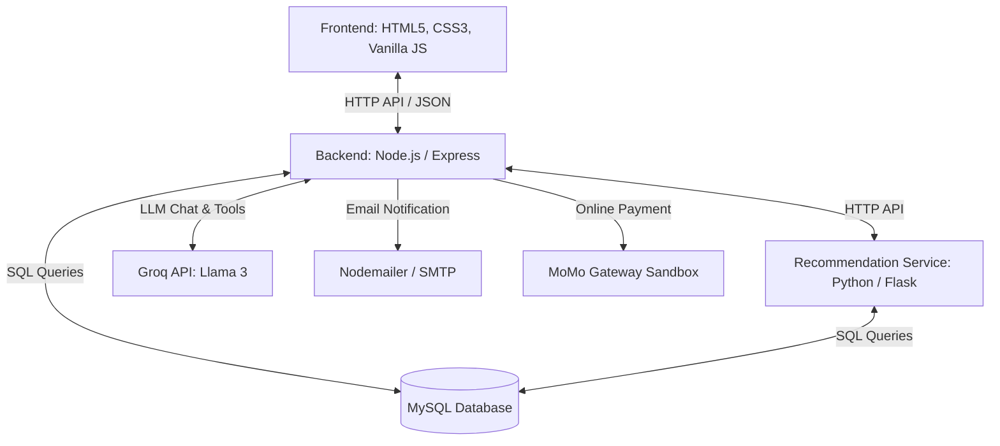

# KHÓA LUẬN TỐT NGHIỆP - KHOA CÔNG NGHỆ THÔNG TIN

# ĐỀ TÀI: XÂY DỰNG HỆ THỐNG BÁN THIẾT BỊ CÔNG NGHỆ KẾT HỢP GỢI Ý SẢN PHẨM THEO HƯỚNG CÁ NHÂN HÓA NGƯỜI DÙNG

---

## 👨‍🎓 THÔNG TIN SINH VIÊN
* **Sinh viên thực hiện:** Đinh Thị Yến Nhi
* **Mã số sinh viên (MSSV):** 110122237
* **Lớp:** Đại học Công nghệ Thông tin

---

## 🎯 1. MỤC TIÊU ĐỀ TÀI
Đề tài nhằm xây dựng một giải pháp thương mại điện tử toàn diện dành cho việc kinh doanh các thiết bị công nghệ (máy tính, linh kiện, điện thoại, phụ kiện...) kết hợp các công nghệ tiên tiến để tối ưu hóa trải nghiệm khách hàng và quản lý cửa hàng hiệu quả:
1. **Cá nhân hóa trải nghiệm mua sắm:** Tích hợp hệ thống gợi ý sản phẩm thông minh dựa trên hành vi, tương tác và sở thích riêng của từng khách hàng.
2. **Hỗ trợ khách hàng tự động và thông minh:** Tích hợp trợ lý ảo (AI Chatbot) sử dụng kỹ thuật RAG (Retrieval-Augmented Generation) kết hợp khả năng truy vấn SQL tự động (Text-to-SQL) để hỗ trợ khách hàng tìm kiếm thông tin sản phẩm, tra cứu đơn hàng, và chế độ bảo hành thời gian thực một cách an toàn.
3. **Quản lý vận chuyển linh hoạt:** Xây dựng module tính toán phí giao hàng dựa trên khoảng cách (Công thức Haversine + Geocoding) kết hợp phân vùng địa lý (Zone-Based Pricing) và tích hợp các đơn vị vận chuyển phổ biến tại Việt Nam (GHN, GHTK).
4. **Hệ thống quản trị mạnh mẽ:** Xây dựng trang admin toàn diện quản lý sản phẩm, đơn hàng, khách hàng, hoạt động kiểm kê, nhập hàng từ nhà cung cấp, và thống kê báo cáo tài chính chi tiết.

---

## 🏗️ 2. KIẾN TRÚC HỆ THỐNG
Hệ thống được thiết kế theo kiến trúc phân tầng dịch vụ (Service-Oriented Architecture - SOA) kết hợp giữa Node.js backend và dịch vụ Machine Learning Python riêng biệt:



### 💻 2.1. Frontend (Giao diện)
* **Công nghệ sử dụng:** HTML5, CSS3 (Vanilla CSS), JavaScript thuần (Vanilla JS).
* **Thiết kế:** Giao diện Responsive thích ứng với nhiều kích thước màn hình, bố cục trực quan, tập trung vào trải nghiệm mua sắm mượt mà.
* **Chức năng chính:** 
  - Khách hàng: Xem sản phẩm, tìm kiếm, bộ lọc thông minh, giỏ hàng, đặt hàng, lịch sử đơn hàng, xem gợi ý sản phẩm cá nhân hóa, chat với trợ lý ảo.
  - Quản trị (Admin): Dashboard thống kê doanh thu, quản lý danh mục, sản phẩm, quản lý đơn hàng, nhập kho (phiếu nhập, nhà cung cấp), kiểm kê kho hàng, cấu hình vận chuyển, và cấu hình khuyến mãi.

### ⚙️ 2.2. Backend API (Máy chủ dịch vụ)
* **Công nghệ sử dụng:** Node.js, Express Framework.
* **Cơ sở dữ liệu:** MySQL (sử dụng thư viện `mysql2` để kết nối và thực hiện truy vấn bất đồng bộ).
* **Bảo mật & Xác thực:**
  - Đăng nhập cục bộ (Local Authentication) sử dụng `bcrypt` mã hóa mật khẩu kết hợp `passport.js` và `JSON Web Token (JWT)`.
  - Đăng nhập liên kết: Hỗ trợ Google OAuth 2.0 (`passport-google-oauth20`).
* **Tính năng đặc biệt:**
  - **Shipping Engine:** Tính phí vận chuyển đa chế độ (Nội bộ/GHN/GHTK) dựa trên khoảng cách địa lý (Haversine & OpenStreetMap API) và Zone-Based.
  - **Payment Integration:** Tích hợp cổng thanh toán trực tuyến MoMo (hỗ trợ cả môi trường sandbox thực tế và chế độ giả lập test).
  - **AI Chatbot ("Yến Nhi Tech"):** Trợ lý ảo sử dụng API từ **Groq Cloud** tích hợp:
    * **RAG (Retrieval-Augmented Generation):** Trích xuất thông tin chính sách của cửa hàng từ file văn bản cục bộ bằng thuật toán tìm kiếm vector TF-IDF tự xây dựng.
    * **Text-to-SQL (Function Calling):** Tự động chuyển đổi ý định người dùng thành các câu lệnh SQL SELECT an toàn (được kiểm duyệt chặt chẽ tránh SQL Injection) để tra cứu thông tin bảo hành đơn hàng, trạng thái vận chuyển, sản phẩm tồn kho một cách trực tiếp từ database.

### 🧠 2.3. Dịch vụ gợi ý sản phẩm (Machine Learning API)
Dịch vụ gợi ý được triển khai riêng biệt bằng Python Flask API nhằm đảm bảo tính độc lập và hiệu năng xử lý dữ liệu lớn.
* **Thuật toán gợi ý cá nhân hóa tích hợp:**
  1. **Collaborative Filtering (Lọc cộng tác - KNN):** Gợi ý sản phẩm dựa trên hành vi tương tác của các khách hàng tương đồng, sử dụng độ đo tương tự Cosine (Cosine Similarity).
  2. **Content-Based Filtering (Lọc dựa trên nội dung):** Phân tích các đặc trưng của sản phẩm (tên, danh mục, thương hiệu, mô tả) bằng mô hình TF-IDF kết hợp tính độ tương đồng Cosine để giới thiệu các sản phẩm tương tự sản phẩm khách hàng đang xem.
  3. **Popularity-Based & Trending:** Gợi ý các sản phẩm có độ phổ biến cao hoặc đang thịnh hành (dựa trên lượt xem, số lần thêm vào giỏ hàng và lượt mua hàng trong 30 ngày gần nhất).
  4. **Hybrid Approach (Gợi ý kết hợp):** Kết hợp các phương pháp trên theo các trọng số cấu hình sẵn (ví dụ: 40% Collaborative + 30% Content-based + 30% Popularity) nhằm khắc phục nhược điểm "Khởi đầu lạnh" (Cold Start) khi người dùng mới chưa có dữ liệu tương tác.

---

## 💻 3. PHẦN MỀM CẦN THIẾT ĐỂ TRIỂN KHAI
Để chạy dự án này trên môi trường local, máy tính của bạn cần cài đặt sẵn các thành phần sau:

| Phần mềm | Phiên bản khuyến nghị | Mục đích |
| :--- | :--- | :--- |
| **Node.js** | `>= 16.x` (LTS) | Khởi chạy máy chủ API chính (Node/Express) và phục vụ frontend tĩnh |
| **Python** | `>= 3.8` | Khởi chạy máy chủ gợi ý (Flask API) và huấn luyện mô hình ML |
| **MySQL Server** | `>= 8.0` | Hệ quản trị cơ sở dữ liệu lưu trữ toàn bộ dữ liệu hệ thống |
| **Git** | Mới nhất | Quản lý mã nguồn dự án |

---

## 🚀 4. HƯỚNG DẪN CHẠY CHƯƠNG TRÌNH

### 🛠️ Bước 1: Cấu hình cơ sở dữ liệu MySQL
1. Khởi động MySQL Server của bạn.
2. Tạo một cơ sở dữ liệu mới có tên `CSDL_DoAnCN` (hoặc tên tùy ý theo cấu hình `.env` của bạn):
   ```sql
   CREATE DATABASE CSDL_DoAnCN CHARACTER SET utf8mb4 COLLATE utf8mb4_unicode_ci;
   ```
3. Import file cơ sở dữ liệu gốc:
   * File nguồn nằm ở đường dẫn: `src/CSDL_DoAnCN.sql`
   * Bạn có thể import thông qua dòng lệnh hoặc công cụ trực quan (như MySQL Workbench, phpMyAdmin, DBeaver):
     ```bash
     mysql -u root -p CSDL_DoAnCN < src/CSDL_DoAnCN.sql
     ```
4. Chạy thêm các migration bổ sung để cấu hình hệ thống gợi ý và tính năng liên quan:
   * Import file SQL: `src/backend/migrations/add_recommendation_tables.sql`
     ```bash
     mysql -u root -p CSDL_DoAnCN < src/backend/migrations/add_recommendation_tables.sql
     ```
   * *Mẹo:* Bạn cũng có thể chạy tệp script tự động `src/backend/run_migrations.bat` (trên Windows) để áp dụng các thay đổi cơ sở dữ liệu mở rộng.

---

### ⚙️ Bước 2: Cài đặt và khởi chạy Node.js Backend
1. Di chuyển vào thư mục backend của dự án:
   ```bash
   cd src/backend
   ```
2. Cài đặt các thư viện Node.js cần thiết:
   ```bash
   npm install
   ```
3. Cấu hình các biến môi trường trong file `.env`:
   * Tạo hoặc chỉnh sửa file `.env` nằm trong thư mục `src/backend/`. Bạn có thể tham khảo cấu hình mẫu bên dưới:
     ```env
     PORT=3000
     NODE_ENV=development
     
     # Cấu hình Kết nối MySQL Database
     DB_HOST=localhost
     DB_USER=your_mysql_username
     DB_PASSWORD=your_mysql_password
     DB_NAME=CSDL_DoAnCN
     DB_PORT=3306
     
     # Bảo mật & Session
     JWT_SECRET=your_jwt_secret_key_here
     SESSION_SECRET=your_session_secret_key_here
     
     # Địa chỉ API Gợi ý (Python Flask Server)
     ML_API_URL=http://localhost:5000
     
     # AI Chatbot Groq API Key
     GROQ_API_KEY=your_groq_api_key_here
     ```
4. Khởi chạy server Node.js:
   ```bash
   npm start
   ```
   * Server sẽ chạy tại địa chỉ mặc định: [http://localhost:3000](http://localhost:3000).

---

### 🧠 Bước 3: Cài đặt và chạy Machine Learning Service (Python Flask)
Dịch vụ gợi ý cần được khởi động để cung cấp API cá nhân hóa cho Node.js backend.

1. Di chuyển vào thư mục chứa mã nguồn Machine Learning:
   ```bash
   cd src/backend/ml_models
   ```
2. Tạo môi trường ảo Python (khuyến nghị để tránh xung đột thư viện):
   ```bash
   python -m venv venv
   # Kích hoạt trên Windows:
   .\venv\Scripts\activate
   # Kích hoạt trên Linux/macOS:
   source venv/bin/activate
   ```
3. Cài đặt các thư viện Python được yêu cầu:
   ```bash
   pip install -r requirements.txt
   ```
4. Thiết lập file cấu hình môi trường `.env` trong thư mục `ml_models`:
   * Copy file mẫu `.env.example` thành `.env`:
     ```bash
     cp .env.example .env
     ```
   * Cập nhật thông tin kết nối MySQL giống với Node.js Backend:
     ```env
     DB_HOST=localhost
     DB_USER=your_mysql_username
     DB_PASSWORD=your_mysql_password
     DB_NAME=CSDL_DoAnCN
     DB_PORT=3306
     ```
5. Huấn luyện các mô hình Machine Learning lần đầu tiên để tạo file lưu trữ mô hình (.pkl):
   ```bash
   python train_models.py
   ```
   * Khi chạy thành công, các file mô hình như `collaborative_filtering.pkl`, `content_based_filtering.pkl`, và `popularity_based.pkl` sẽ được lưu trữ trong thư mục `trained_models/`.
6. Khởi chạy máy chủ API Flask:
   ```bash
   python recommendation_api.py
   ```
   * *Mẹo:* Trên Windows, bạn có thể chạy file `start_api.bat` hoặc trên Linux chạy `start_api.sh` để kích hoạt nhanh.
   * Dịch vụ Flask API sẽ chạy tại địa chỉ: [http://localhost:5000](http://localhost:5000).

---

### 🌐 Bước 4: Truy cập và sử dụng ứng dụng
Sau khi cả Node.js server (cổng 3000) and Python server (cổng 5000) đều đã được khởi động thành công:
1. Mở trình duyệt web của bạn.
2. Truy cập địa chỉ trang chủ: [http://localhost:3000](http://localhost:3000).
3. Hệ thống sẽ tự động phục vụ giao diện trang chủ mua sắm dành cho người dùng. 
   - Để truy cập trang quản trị Admin: Truy cập đường dẫn [http://localhost:3000/admin](http://localhost:3000/admin) hoặc đăng nhập bằng tài khoản có vai trò `admin`.

---

## 📈 5. BẢO TRÌ & HUẤN LUYỆN LẠI MÔ HÌNH (RETRAIN MODELS)
Để đảm bảo các kết quả gợi ý luôn chính xác và cập nhật theo xu hướng mua sắm mới nhất của người dùng, mô hình gợi ý nên được huấn luyện lại định kỳ.

### Cách 1: Huấn luyện lại thủ công bằng script
```bash
cd src/backend/ml_models
python train_models.py
```

### Cách 2: Gọi API huấn luyện lại từ xa
Bạn có thể gửi một yêu cầu `POST` tới API Flask để kích hoạt tiến trình retrain:
```bash
curl -X POST http://localhost:5000/train
```

### Cách 3: Lập lịch tự động (Cron job - khuyến nghị cho sản xuất)
* **Trên Linux/macOS:** Thêm dòng sau vào cấu hình `crontab` để tự động chạy huấn luyện lại vào 2 giờ sáng Chủ Nhật hàng tuần:
  ```bash
  0 2 * * 0 cd /path/to/project/src/backend/ml_models && ./venv/bin/python train_models.py
  ```
* **Trên Windows:** Sử dụng **Task Scheduler** để tạo lịch biểu chạy định kỳ file `train_models.py` với Python interpreter.
